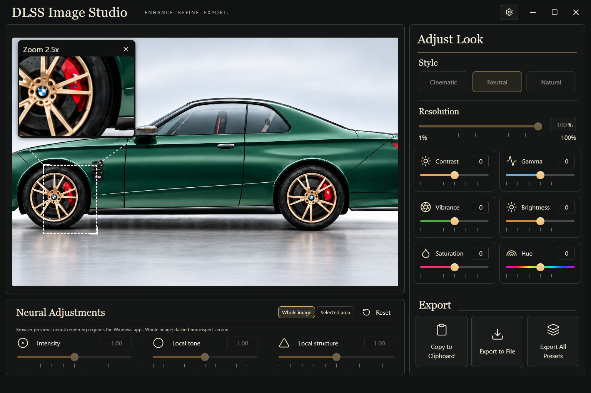

# DLSS Image Studio

A Windows image editor built with Tauri 2, React, TypeScript, Rust and D3D12. Neural rendering uses a separately installed **Visual Enhancer v13.2** runtime. Conventional color adjustments remain separate.



## Setup

Download and extract the complete [official Visual Enhancer v13.2 package](https://github.com/Merserk/dlss5-visual-enhancer/releases/tag/v13.2), review its licenses, then select its folder in Studio Settings. No proprietary runtime is bundled. See [integration details](DLSS_INTEGRATION.md).

Intensity, Tone and Structure now call the provider, each with range 0–2 and default 1. The right-hand Style buttons select the neural style. Color presets are available in Settings. The former brightness/detail substitutes have been removed. Studio requires successful NGX creation and evaluation diagnostics; failures never silently become ordinary filters.

## Features

- Full-image neural rendering by default; explicit optional feathered region mask.
- Zoom inspects the same processed pixels as the main image and exports.
- Separate contrast, gamma, vibrance, brightness, saturation and hue, plus three color presets.
- Ctrl+O, image paste and drag-and-drop; draggable zoom, wheel magnification, Z to restore it.
- Original-dimension PNG/JPEG/TIFF export, Windows clipboard, and three-neural-style batch export.
- Local processing, cached neural results, runtime diagnostics and obsolete-preview rejection.

## Build and verification

See [BUILDING.md](BUILDING.md). Run `npm ci`, `npm test`, and `npm run tauri build`. Browser development (`npm run dev`) is explicitly color-only. Hosted build success does not prove neural rendering.

See the [RTX 4090 verification report](docs/NEURAL_VERIFICATION.md). To exercise the provider locally after configuring it:

```powershell
cargo test --manifest-path src-tauri/Cargo.toml --release real_neural_pipeline -- --ignored --nocapture
```

## Limits

Images are 8-bit sRGB. Original alpha and dimensions are retained; odd/small images are padded for evaluation then cropped back. JPEG drops alpha. HDR, metadata round-trip and ICC embedding are not implemented. Limits are 64 megapixels and 16384 pixels per side; GPU memory may impose lower limits. Neural upscaling, video and advanced provider controls are not exposed.

A persistent provider and binary pixel pipes keep warm adjustments fast (roughly 33–45 ms for the 1560×1008 sample through the native pipeline on RTX 4090). Cold startup or a new processing size takes about two seconds. The restored Resolution slider scales neural evaluation size from 1–100%; outputs retain original dimensions. While processing, completed intermediate frames can be displayed and exports are disabled. Files are not overwritten. Batch failure can leave completed exports. Logs are local at `%LOCALAPPDATA%/DLSS Image Studio/logs/studio.log`.

Independent application; not affiliated with NVIDIA or Merserk. Their trademarks and separately installed software remain subject to their owners' terms.
