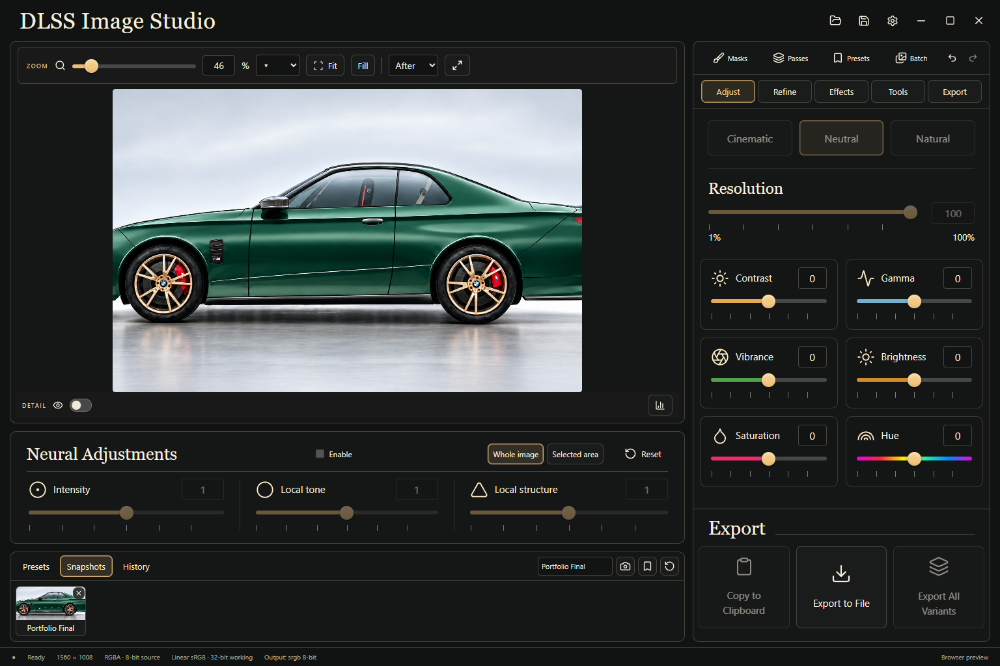

# DLSS Image Studio

A focused Windows render-finishing application: open a render, enhance, refine, compare, and export. Built with Tauri 2, React, TypeScript, Rust, and a D3D12 neural-provider bridge.



## Version 0.2

- The original two-column studio appearance: large viewport, colored slider cards, neural adjustments below the image, contextual advanced tabs, and snapshots/presets/history along the bottom.
- Wheel zoom, numerical zoom, Fit/Fill, pan, vertical/horizontal before-after splits, temporary original view, a floating 1–10× inspector, pixel grid, presentation mode and fullscreen.
- Existing **real neural rendering** and neural styles, intensity, tone, structure and evaluation resolution. Conventional processing stays separate.
- Scene-linear float finishing: exposure and tonal ranges, RGB/channel curves, white balance, three-way grading, denoise, sharpening, clarity, texture and broad local contrast.
- [LUT grading](docs/LUTS.md): 50 bundled MIT/CC0 creative looks, custom CUBE import, strength/bypass, HDR range handling, and portable project/preset assets. Open **Refine → LUTs**.
- Non-destructive shape, polygon, brush/eraser, gradient, color, luminance and data-pass masks; combine/subtract/intersect, feather, opacity, expand/contract, blur and editable dodge/burn.
- Flat multilayer EXR and individual data-pass import, pass inspection/remapping, depth-range selection, focus picking, depth-weighted blur and fog.
- Half/float EXR and 16-bit PNG/TIFF output. Tagged sRGB, Display P3, Rec.709 and linear exports; ACEScg EXR. Original dimensions remain the default.
- Project save/reopen, recoverable project backups, undo/redo, snapshots, preset libraries and a persistent-in-session batch queue.

This release implements the core finishing workspace, **not every item in the full professional-tools specification**. See the [implementation and limits matrix](docs/PROFESSIONAL_WORKSPACE.md).

## Neural runtime

Install the complete [Visual Enhancer v13.2 package](https://github.com/Merserk/dlss5-visual-enhancer/releases/tag/v13.2) separately, review its terms, and choose its folder in Studio Settings. No Neuroframe or NVIDIA runtime DLLs are bundled. See [integration details](DLSS_INTEGRATION.md).

Neural controls use the provider's supported 0–2 ranges, default 1. DLSS Detail 0–100 maps to intensity 0–2. Resolution controls evaluation size without forcing an output resize. Failed neural evaluation blocks export of the failed state; the app never substitutes an ordinary filter.

The provider accepts 8-bit and 16-bit display-referred RGBA. High-bit-depth SDR sources use a 16-bit sRGB neural transport and return directly to float finishing without the 8-bit color backend. Original float alpha and source data are retained. For HDR/extended-gamut sources, click **Tone-map for neural** below Neural Adjustments: this explicitly compresses highlights into a 16-bit SDR working copy before actual neural evaluation. **Use original HDR** returns to float editing with neural rendering off. The original source is never overwritten; neural output from the tone-mapped copy is SDR, not an unbounded HDR neural result.

## Quick use

1. Open or drop a render. EXR, PNG, TIFF, JPEG and WebP are supported.
2. Choose a style, refine Enhance/Tone/Color/Local, and compare with **B** or a split view.
3. Capture named snapshots. Use Masks or Passes for targeted finishing.
4. Export at original dimensions; use EXR to preserve HDR or 16-bit PNG/TIFF for an integer deliverable.

**Ctrl+O** open · **Ctrl+S** project · **Ctrl+Shift+S** Save As · **Ctrl+E** export · **Ctrl+Z / Ctrl+Shift+Z** undo/redo · **F** fit · **1** 100% · **B** before/after · hold **\** original · **Space+drag / middle drag** pan · **Tab** presentation · **F11** fullscreen · **M** masks · **Z** inspector.

Sliders and numeric values support dragging, typing, keyboard arrows, Shift for fine movement, Ctrl/Cmd for finer movement, and double-click/right-click reset.

## Build and verification

See [BUILDING.md](BUILDING.md), the [professional-workspace verification](docs/PROFESSIONAL_VERIFICATION.md), and [earlier neural-runtime evidence](docs/NEURAL_VERIFICATION.md).

```powershell
npm ci
npm test
cargo test --manifest-path src-tauri/Cargo.toml
npm run tauri build
```

Browser development uses a separate worker for conventional finishing and UI checks. It cannot run the neural provider or native HDR/pass/project workflows. GitHub build success does not establish neural evaluation; that requires the separately installed runtime and physical compatible hardware.

Open-source dependency notices ship in [THIRD_PARTY_NOTICES.txt](THIRD_PARTY_NOTICES.txt). Runtime components remain separately licensed. Independent application; not affiliated with NVIDIA or Merserk.
