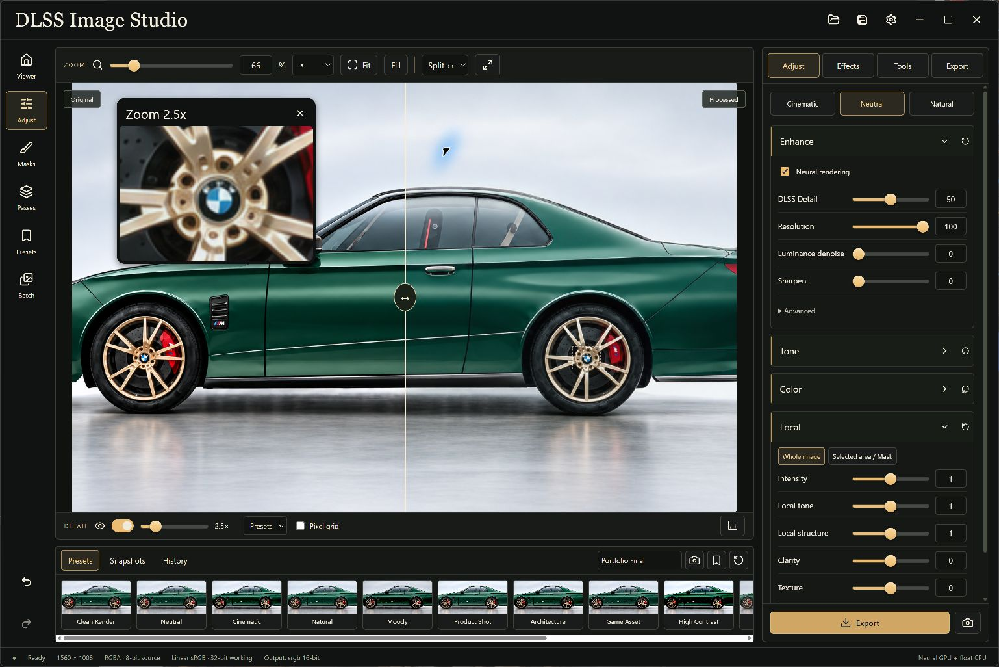

# Version 0.2 verification

Verified on 29 September 2026 on Windows with an NVIDIA GeForce RTX 4090, driver 591.86, and the separately installed Visual Enhancer v13.2 runtime. This report covers the implemented core workspace. It does not certify every requested professional feature; see the [implementation and limits matrix](PROFESSIONAL_WORKSPACE.md).



## Automated checks

| Check | Result | What it establishes |
| --- | --- | --- |
| Frontend unit suite | 25 passed | Neutral identity, immutable sources, masks, crop/rotation, curves, partial presets, project state, and existing adjustment behavior |
| Standard native suite | 20 passed | Float/HDR identity, alpha, half/float multilayer EXR, 16-bit precision, tagged output color round trips, mask rasterization, project validation/backups, unsupported inputs and output overwrite refusal |
| Local ignored GPU suite | 2 passed | Actual provider evaluation on the RTX 4090, neural parameter/style effects, cached export agreement, source reloads, region composition and original dimensions |
| Preview transport script | Passed | Latest-result ordering, failure/recovery, matching inspector, held sliders, fine keyboard adjustment, undo/redo, split/pan/zoom, reduced drag preview and full-size refinement, project flow, batch persistence and export readiness |
| Workspace browser script | Passed | Real conventional browser processing, masks, comparison, snapshots, format defaults; no JavaScript errors or horizontal overflow at 1536×1024 and 1080×840 |
| TypeScript / Vite / Tauri release build | Passed | Production compilation and packaging inputs |

The transport script deliberately uses a synthetic native transport. Its success is not evidence of neural execution. The browser worker is also separate from the native float pipeline. The two physical-GPU tests provide the neural evidence.

## Actual neural evaluation

The provider returned `gpu_name: NVIDIA GeForce RTX 4090`, `gpu_mode: true`, `feature_evaluations: 1`, and successful create/evaluate values of `0x00000001`. Those values are the provider's normalized success fields, not independently intercepted raw DLL return values. The provider reports a host/CUDA/D3D12 shared-memory path and an RGBA8 output. The bridge and runtime remain separately installed and licensed.

The test source was 1560×1008. Default neural output differed from the source; intensity zero, tone zero, structure zero, maximum settings, Natural and Cinematic each differed from the default neural result. The generated original, neural and finished images were inspected. Visible changes do not establish a universal guarantee that a black-box neural renderer preserves every logo, decal or geometric detail.

The final float-pipeline test measured:

- Cold provider start plus neural and float processing: **2.547 seconds**.
- Cached neural output plus exposure/clarity finishing at full source size: **70.3 ms**.
- Successful original-size 16-bit PNG export with display-preview mean absolute error at most one 8-bit code value.

Separate neural-only warm-control tests measured:

| Evaluation resolution | Warm total range | Warm mean |
| --- | --- | --- |
| 100% | 31.8–34.1 ms | 32.6 ms |
| 50% | 21.8–22.4 ms | 22.1 ms |
| 25% | 17.8–18.2 ms | 18.0 ms |
| 1% | 15.9–17.2 ms | 16.5 ms |

Changing evaluation dimensions incurred roughly 2.2 seconds of feature reallocation before these warm timings. These are measured test-image timings, not a 60 FPS promise or 4K benchmark. The new scene-linear finishing operators run on CPU/Rayon. Interactive dragging reduces their preview size; settled output and export use full dimensions. View-only zoom/pan does not evaluate the provider.

Machine-readable, path-free evidence is in [professional-gpu.json](verification/professional-gpu.json). Reproduce with:

```powershell
$env:STUDIO_NEURAL_RUNTIME = 'D:\software\VisualEnhancer-v13.2'
cargo test --manifest-path src-tauri/Cargo.toml --release -- --ignored --nocapture --test-threads=1
```

## Installed desktop checks

The release executable was copied to `D:\software\dlss-image-studio\app\dlss-image-studio.exe`. Its SHA-256 matches the locally built executable:

`C006854517E8870A65DFAB3276020F7CEB70F1925E0F52E95C980AF82519D8A8`

The previous executable is retained at `verification/pre-professional-workspace.exe`, and dependency notices are installed beside the application.

Native UI checks confirmed:

1. A 16-bit source opens with float working precision and neural controls disabled, with a visible explanation.
2. Dragging Exposure updates the main view and magnifier; the UI returns to Ready.
3. Ctrl+S writes a real `.dlssproj` containing exposure 0.65, source reference, two history states and 16-bit output settings.
4. Relaunching with that project restores the source and settings; Ctrl+Z restores the earlier exposure and returns to Ready.
5. Ctrl+E exports a decodable, ICC-tagged, 16-bit RGBA PNG at the original 1560×1008 dimensions.
6. An 8-bit render loads through the real neural provider in the installed app and reaches Ready.
7. The floating inspector moves, samples the selected wheel detail from the processed image, and the vertical original/processed split shows both versions.

Windows file-dialog editing through the automation helper had a stale-element limitation. The dialogs' normal Save buttons worked and the saved files were independently read and decoded. No claim is made that all combinations of tools, formats, renderers, drivers or large production EXRs have been manually exercised.

## Explicit boundaries

The external neural interface accepts display-referred 8-bit pixels. It is disabled for HDR/high-bit-depth sources; the app does not silently quantize them. Float finishing and export retain their source precision and finite HDR range. Clipboard and the screen preview are display-referred 8-bit copies.

Cryptomatte decoding, OCIO/ACES display/AgX/Filmic transforms, optical bokeh, independent adjustment stacks per mask, advanced lens models and other items listed in the limits matrix remain unfinished. They are not presented as working controls. The app's EXR support covers flat layers/channels, not deep or offset-data-window EXRs. Source metadata round-trip is not implemented.

GitHub's Windows workflow runs unit, interaction and build checks and produces installer/executable artifacts. Hosted build success is not GPU verification; the physical RTX results above are separate.
